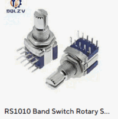
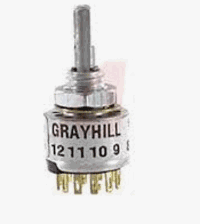
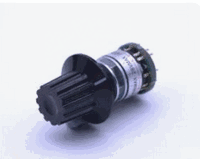
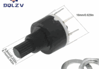
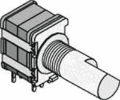
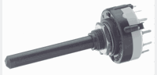

# Rotary Switch Choice

Three rotary selectors are needed: **Mode** (5 pos), **Fan speed** (5 pos), **Temperature** (10–11 pos).

## Switch families considered

### RS1010 — reference form factor



PCB through-hole mount, M7×0.75 bushing (~12.5 mm), 6 mm shaft, 30° indexing, compact body.

| Variant | Config | Max positions |
|---|---|---|
| RS1010 | 1P | 2 – 6 |
| RS1010 | 2P | 2 – 4 |

**Tops out at 6 positions.** Fine for Mode (5 pos) and Fan (5–6 pos). Not enough for Temperature (need 10–11).

Electrical rating: 0.1 A / 16 V DC — more than adequate for resistor-ladder ADC readout.

### Grayhill 56 series



Same compact footprint as RS1010 (~12.7 mm bushing), available up to 12 positions (1P12T), well-documented, PCB through-hole. Good drop-in candidate for the temperature selector.

### NKK MR-K112



Ultra-compact, ~13 mm, up to 12 positions (1P or 2P), 2.54 mm PCB pitch. Slightly smaller than RS1010. Less common but very clean form factor.

> **Overkill & expensive.** Premium part aimed at industrial/medical applications. [Datasheet](https://www.nkkswitches.com/pdf/MRlogicLevel.pdf)

### Alpha series — [official product list](https://www.taiwanalpha.com/en/products/8?cat=59)

### Alpha SR1610



16 mm body, PCB through-hole, 6 mm D-shaft, 30° indexing. Available 1P or 2P, up to 12 positions. Widely stocked (Tayda, Mouser). Common in DIY audio/synth projects. Noticeably bigger than RS1010.

### Alpha SR1712F


17 mm body, PCB through-hole, D-shaft, 30° indexing. Available 1P or 2P, up to 8 positions. Rated 0.3 A / 16 V DC, non-shorting contacts, 10 000 cycle lifetime. Sufficient for Mode (5 pos) and Fan (5 pos), not enough for Temperature (10–11 pos). [Datasheet](https://www.mouser.com/datasheet/2/13/SR1712F-1815245.pdf)

### Alpha SR2510 / SR10010F



25 mm body, PCB through-hole, up to 12 positions. Larger footprint — same family but noticeably bulkier. Overkill for Mode/Fan; covers Temperature but at the cost of panel space.

### Lorlin CK1060 / CK1032



27.5 mm body — much larger. Already in BOM as fallback. Position-limiting washer allows bridging a 1P12T to any count ≤ 12. Proven and cheap but bulky for a compact enclosure.

### 8404-3C (on hand)

3P4T (3 circuits, 4 positions). Only 4 positions — covers OFF / Fan / Cool / Heat, dropping Dry. The 3 independent circuits are unused in this design (resistor-ladder uses only one pole). Usable if Dry mode is dropped.

---

## Readout method: resistor ladder on ADC

All selectors wired as a resistor ladder on a single ADC pin. Equal resistors in series between each position output; common pin to ADC; one end to 3.3 V, other end to GND.

- Mode (4 pos) → 1 ADC pin
- Fan (6 pos) → 1 ADC pin
- Temperature (11 pos) → 1 ADC pin

Total: **3 ADC pins**. On RP2040 (Pico), ADC0–ADC2 are all usable without restriction.

Ladder resistor value: 10 kΩ per step is a safe starting point. Spacing between voltage levels is ~300 mV per step for the 11-position ladder (3.3 V ref, 12-bit ADC → ~3 mV/LSB). Margin is comfortable — noise is typically a few mV.

**Important:** power the ladder from the regulated 3.3 V rail, not VSYS (raw Li-Po). A varying supply voltage would shift all ADC readings as the battery drains.

## Wake-from-sleep detection

The MCU sleeps between transmissions and must wake on any knob or button change. Buttons naturally generate a GPIO edge. Rotary switches on a resistor ladder do not — a position change produces a DC voltage shift, not an edge.

**Sleep is mandatory.** Without it, the MCU draws ~25 mA continuously. At that rate a 2000 mAh cell lasts ~80 hours — weeks, not the 6-month target. Sleep current on RP2040 is ~1–2 mA, putting the budget back in range.

Three approaches to generate a wake edge from a rotary switch:

### On relying on the inter-contact float

An obvious approach is to detect the wiper floating between contacts — when the wiper lifts off a contact, a pull-up drives the GPIO high, producing a rising edge.

This is fragile for two reasons:

**Non-shorting vs shorting switches.** Non-shorting (break-before-make) switches have a guaranteed float period — the wiper leaves the old contact before touching the new one. Shorting (make-before-break) switches may have no float at all; the wiper bridges both contacts simultaneously during transition. The wake pulse may never occur on a shorting switch.

**Float duration is unspecified.** Even on non-shorting switches, the spec only guarantees the order of events, not the duration of the float. A fast detent snap can produce a float of only a few microseconds — potentially too short to reliably trigger a GPIO interrupt depending on MCU wake latency.

**Conclusion:** do not rely on the inter-contact float for wake detection. Detect the voltage change on landing instead — either via a second pole (Option A) or an HPF spike on the ladder wire (Option B).

---

### Option A — 2-pole switch (preferred)

One pole drives the ADC ladder. The second pole has all contacts shorted to 3.3 V, wiper to a GPIO with pull-down. Any knob movement breaks contact → falling edge → MCU wakes.

- Clean, reliable, no extra components.
- Wake signal is independent of shorting/non-shorting switch type.
- Requires **2P variants** for all rotary switches.
- Total: 3 ADC pins + 3 wake GPIOs. Well within RP2040's 26 GPIOs.

### Option B — RC differentiator + comparator (fallback)

A high-pass RC filter (cap in series, resistor to GND) on the ADC wiper line differentiates the DC step into a voltage spike on transition:

```
wiper ──┤C├──┬── to comparator
             R
             │
            GND
```

Spike amplitude ≈ voltage step size (~300 mV for 11-position ladder) — **below the RP2040 GPIO logic threshold (~1.0–1.6 V)**. A comparator with adjustable threshold is required to detect it reliably.

- Works on 1P switches — no 2P requirement.
- Robust to shorting/non-shorting switch type — fires on the voltage step at landing, not on the float.
- Adds a comparator IC (e.g. LM393 dual, one per two switches) plus RC passives.
- Detects transitions only, not settled position — acceptable for wake purposes.
- Mechanical bounce during slow rotation may produce multiple spikes — also acceptable.
- More complex and likely more expensive than Option A.

**Use only if 2P switches are unavailable or exceed BOM budget.**

### Option C — shift register (74HC165) with periodic wake

Instead of the ADC ladder, each switch position is wired to one input of a daisy-chained **74HC165** (parallel-in, serial-out shift register). The MCU clocks through all inputs in a tight serial read cycle: 3 pins total (CLK, LATCH, DATA) regardless of total input count.

```
switch positions ──► [74HC165] ──┐
                                  ├── DATA → MCU (1 pin)
switch positions ──► [74HC165] ──┘
                    CLK, LATCH ←── MCU (2 pins)
```

- Purely digital — no ADC, no threshold tuning, no resistor ladder.
- Scales freely: add more switches, same 3-pin interface.
- Per-position wiring is simpler: one wire per position to GND, pull-ups on the 165.

**Wake-from-sleep problem:** the shift register is passive — the MCU must be awake to initiate a read cycle. It cannot detect a position change while sleeping. A separate wake signal is still required, so the 2P switch requirement is not eliminated. The only alternative is **periodic wake** (e.g. every 2–5 seconds to poll), which increases average sleep current and reduces battery life compared to edge-triggered wake.

**Verdict:** the shift register is a cleaner digital design and worth considering if ADC noise or ladder calibration becomes a problem in practice. It does not help with the wake problem. Combine with Option A (2P switch second pole for wake) if used, or accept the battery life penalty of periodic polling.

---

## Decision matrix

All switches must be **2-pole (2P)** — one pole for ADC ladder, one pole for wake GPIO. See "Wake-from-sleep detection" above.

| Selector | Positions needed | Candidate | Body size | Poles | Decision |
|---|---|---|---|---|---|
| Mode | 4 | 8404-3C (on hand) | unknown | 3P4T | **preferred** (spare poles unused) |
| Mode | 4 | RS1010 2P4T | compact | 2P | alternative |
| Fan speed | 6 | Alpha SR1712F 2P8T (bridged to 6) | 17 mm | 2P | **preferred** |
| Temperature | 11 | Alpha SR1610 2P12T (bridged to 11) | 16 mm | 2P | **preferred** |
| Temperature | 11 | Lorlin CK1032 2P bridged to 11 | 27.5 mm | 2P | fallback (bulkier) |
| Temperature | 11 | Grayhill 56SP12 | compact | 1P | **ruled out — ~€30, exceeds BOM budget** |
| Temperature | 11 | NKK MR-K112 | ultra-compact | 2P | ruled out — expensive/overkill |

### Temperature range with 10 positions

The RS1010 family (and Grayhill 56 bridged to 10) covers 10 steps. Two practical mappings:

| Mapping | Range | Missing |
|---|---|---|
| 16–25 °C | 10 steps × 1 °C | 26 °C |
| 18–27 °C | 10 steps × 1 °C | 16–17 °C and 26 °C |

**16–25 °C is the realistic daily-use range** for a European home. Dropping 26 °C is acceptable.

With a 12-position switch bridged to 11: full 16–26 °C coverage is possible.

---

## Open questions

- [ ] Confirm enclosure footprint allows three knobs (16–17 mm body) side by side in 80×100 mm panel.
- [ ] Verify ADC voltage spacing for 11-position ladder on bench (3.3 V ref, 12-bit → ~3 mV per LSB, ~300 mV per step with equal 10 kΩ resistors).
- [ ] Source and price check: Alpha SR1610 2P12T and SR1712F 2P on Tayda / Mouser / LCSC — confirm availability and cost within BOM budget.
- [ ] Confirm Lorlin CK1032 has a 2P variant (fallback for Temperature).
- [ ] Confirm shaft length and knob compatibility (6 mm D-shaft vs round shaft) for SR1610 / SR1712F.
