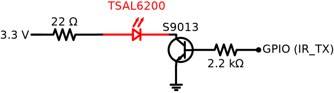
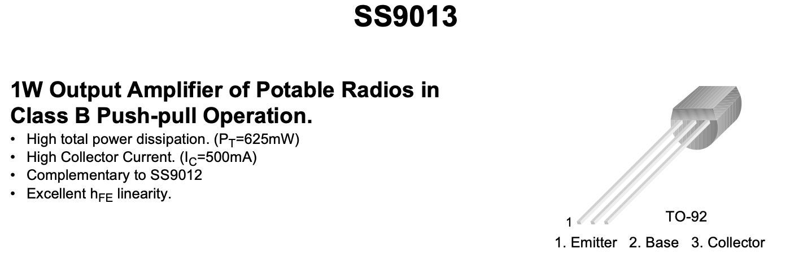
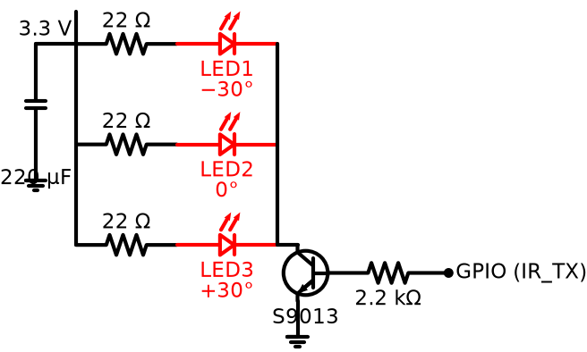

# 06 — IR LED Wiring (TSAL6200)

Target: **ATmega328P Pro Mini 3.3 V**, powered from 2× AA/AAA or Li-Po (~3.0–3.3 V).
No boost converter — everything runs at 3.3 V.

## TSAL6200 Key Specs

| Parameter | Value |
|---|---|
| Peak wavelength | 940 nm |
| Max continuous current (If) | 100 mA |
| Max peak current (pulsed, 1/3 duty) | 1 A |
| Forward voltage (Vf @ 100 mA) | ~1.35 V |
| Half-angle | ±17° |
| Radiant intensity @ 100 mA | ~80 mW/sr |

The ±17° beam is focused — useful for range, but alignment matters.

## ATmega328P GPIO Constraints

- GPIO max source current: 40 mA per pin (20 mA recommended)
- A transistor is required to drive the LED at useful power

## Headroom at 3.3 V

```
Available across resistor = Vcc - Vf - Vce_sat
                          = 3.3V - 1.35V - ~0.2V  ≈  1.75 V
```

Vf rises slightly at high current (~1.5 V at 300 mA) — keep per-LED current at
**100 mA max** to stay in a predictable operating region with this supply.

## Single LED — Basic Circuit

Drive at **100 mA peak, 38 kHz, 1/3 duty cycle**.

```
R = (3.3V - 1.35V) / 0.1A = 19.5 Ω  → use 18 Ω or 22 Ω
R_base = 2.2 kΩ  (GPIO at 3.3V: 3.3V / 2.2kΩ ≈ 1.5 mA into base, hFE×Ic headroom fine)
```

**Transistor:** S9013 H331 (Ic_max 500 mA, TO-92) — well within ratings.



Current flows left → right: **3.3 V → 22 Ω → LED → transistor → GND**.

**Package orientation (TSAL6200, 5 mm radial):**

- **Anode** (long lead, round side of the package) faces the **22 Ω resistor / 3.3 V** side.
- **Cathode** (short lead, marked by the **flat** on the package rim) faces the **transistor collector** side.
- So the **flat faces the transistor**. Current path: 3.3 V → R → anode → cathode → collector → emitter → GND.

**S9013 (NPN, TO-92, flat face forward): E – B – C** (left to right, per datasheet):



- **Emitter (E, left)** → **GND**.
- **Base (B, centre)** → through R_base (2.2 kΩ) to the **GPIO**.
- **Collector (C, right)** → the **LED cathode**.

Range: ~2–3 m with a single LED at 100 mA. Use the multi-LED version for 3–4 m.

## Multi-LED Version — Widening the Angle

3 LEDs pointed in different directions (0°, ±30°) widens coverage to ~±47°,
and triples total radiant power for better range.

### Wiring: 3 LEDs in parallel, each with its own series resistor

Each LED gets its own resistor to balance current (never share a single resistor).

```
If per LED  = 100 mA
If_total    = 3 × 100 mA = 300 mA  →  S9013 (500 mA) handles this comfortably
R per LED   = (3.3V - 1.35V) / 0.1A = 19.5 Ω  → use 18 Ω or 22 Ω each
R_base      = 2.2 kΩ
```



### Angular coverage

| Config | Half-angle | Effective coverage |
|---|---|---|
| 1 LED | ±17° | ~34° cone |
| 3 LEDs (0°, ±30°) | ±17° each | ~±47° effective |
| 3 LEDs (0°, ±45°) | ±17° each | ~±62° effective |

## Bulk Capacitor — Rail Stabilisation

2× AA batteries have significant internal resistance (~0.5–2 Ω, rising toward end of life).
A 300 mA IR pulse causes a rail sag that can reset the MCU:

```
Sag = If_peak × R_internal = 300 mA × 1.5 Ω = 0.45 V  ← dangerously close to MCU brownout
```

A bulk capacitor placed close to the transistor/VCC node supplies the transient current
locally and keeps the rail stable. It does not increase LED current — it prevents the
voltage from drooping below the calculated value.

**Sizing:**
```
C ≥ If_peak × t_pulse / ΔV_allowed
  = 300 mA × 600 µs / 0.1 V
  ≈ 1800 µF for ΔV < 100 mV
```

In practice a single large cap is not needed — the Daikin frame is a series of short bursts,
and the battery recovers between marks. **100–470 µF** is the practical range:

| Value | Notes |
|---|---|
| 100 µF | Minimum — fine for fresh batteries |
| 220 µF | Good default |
| 470 µF | More comfortable at end-of-life batteries |

Use an electrolytic, placed physically close to the collector/VCC node. Polarity matters.

## Component Summary

| Component | Value | Notes |
|---|---|---|
| TSAL6200 | × 1 or × 3 | 940 nm, ±17°, 100 mA |
| Q1 NPN | S9013 H331 | Ic 500 mA, hFE 144–202 (H group), TO-92, EBC pinout |
| R_base | 2.2 kΩ | GPIO → base |
| R_series | 22 Ω each | 100 mA per LED at 3.3 V |
| C_bulk | 220 µF electrolytic | rail stabilisation, close to Q1 collector |

## Notes

- **S9013 pinout (TO-92, flat face forward): E – B – C** (left to right, per datasheet). Same order as BC337 — but always verify against the datasheet before soldering, since other 9013 variants and clones sometimes differ.
- At 1/3 duty cycle (Daikin/NEC encoding), average current per LED is ~33 mA — well within continuous ratings.
- The IRremote library (AVR target) handles the 38 kHz carrier via timer — no manual toggling needed.
- For the multi-LED version, bend the outer LEDs to the target angle before soldering; a small cardboard jig helps keep angles consistent.
- Desolder the Pro Mini power LED before measuring sleep current — it draws ~1 mA continuously and dominates the sleep budget.
