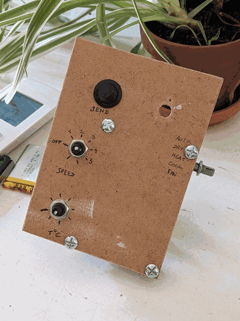
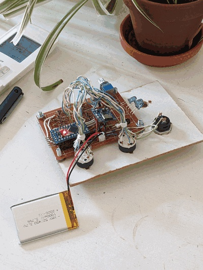

# TroisMolettes

**A better AC remote** — a physical IR remote for a Daikin split unit that is:

- **tangible** — all-hardware controls, no screen or app
- **stateless** — no menus; the knob positions _are_ the state
- **nicely designed** — an object worth leaving on the table

Three rotary knobs set **fan speed/power**, **mode**, and **temperature**. A **Send** push button transmits the current state via IR; an optional **Swing** toggle handles louvre swing if panel space allows. There is no per-position indicator — the only feedback is a single LED that flashes on send. A single (or 3× fanned) IR LED transmits to the AC unit.

Target AC unit: Daikin FTXM20N2V1B · Original remote: ARC466A33 · Protocol: `DAIKIN` (frame ported to AVR `IRremote`; `IRDaikinAC` from IRremoteESP8266 used as the reference format)

## Hardware summary

- **Controls:** 3 rotary selectors + Send button (+ optional Swing toggle). **v1** (bench): plain 1-pole ALPHA SR16 / RS1010 read via a diode matrix — see [05_electronics_circuit.md](docs/05_electronics_circuit.md). **v2** (planned): Bourns PAC18R absolute encoders — Gray-coded, no diodes, 2.5 mm-pitch through-hole — see [05_electronics_circuit_v2.md](docs/05_electronics_circuit_v2.md)
- **MCU:** Arduino Pro Mini 3.3 V (ATmega328P), ported and tested. Sleeps in `SLEEP_MODE_PWR_DOWN`, woken by PCINT both-edge on every code/button line. Sleep floor dominated by the Pro Mini LDO quiescent (~75 µA) — bench-validation pending. (nRF52840 / STM32L4 give lower µA-class sleep but aren't needed yet; see [03_microcontroller_choice.md](docs/03_microcontroller_choice.md))
- **IR:** TSAL6200 940 nm LED (×1 or ×3 fan) + S9013 NPN transistor driver, 38 kHz carrier via the 328P Timer2 (OC2B, pin D3), Daikin ARC466A33 frame ported and validated against the real unit
- **Power:** recommended path is **2× AAA driving the 328P directly** (1.8–3.2 V, no regulator → ~4 µA sleep floor, fully through-hole); Li-Po + TP4056 USB-C is the fallback if the ~1.8 V IR/readout checks fail. MCU sleeps between transmissions (6-month → multi-year target — bench-validation pending; see [07_battery_and_power.md](docs/07_battery_and_power.md))

## Status & roadmap

All three subsystems — selector readout + sleep/wake, real Daikin IR comms, AVR
firmware port — are individually proven on the bench (see the [bench logs](#bench-logs-build-journal)).

**✅ Prototype integration on a wood panel** — real encoders wired to the devboard,
running end-to-end. Still missing: panel labels, the rs1010 side-switch panel layout,
attaching the battery, and temperature-range tuning.

Lessons learned:

- Rotary switch mounting and wiring needs rework — doesn't scale to three knobs in an enclosure.
- A nice box without a PCB is hard — perfboard wiring mess and component size (the
  readout diodes especially) eat panel space fast. (v2 fix under evaluation: a coded
  absolute encoder deletes the diode array — see [05_electronics_circuit_v2.md](docs/05_electronics_circuit_v2.md).)
- A Li-Po battery is likely overkill; measure actual sleep/active current before picking a chemistry.
- 3× IR LEDs work electrically but aren't enclosure/design-friendly; worth revisiting
  against a single wider-angle LED.
- Open question: is a dedicated swing switch worth the panel space, or should swing
  live on an existing control?

### Next: v2 — switches, board & enclosure

- Rotary selector — leaning to the **Bourns PAC18R absolute encoder** (Gray-coded,
  2.5 mm-pitch through-hole, real knob shaft). Deletes the diode array and the readout
  transient problem; keeps perfboard viable. Open: confirm Mouser price vs ≤ €5/unit.
- PCB vs. perfboard — only need a custom PCB (KiCad) if a part is off the 2.54 mm grid;
  the PAC18R is on-grid, so perfboard may still do.
- IR LED choice — single wide-angle vs 3× fan
- Battery choice — AA with regulator?

## Files

| File                                                                    | Description                                                                                                      |
| ----------------------------------------------------------------------- | ---------------------------------------------------------------------------------------------------------------- |
| [00_specifications.md](docs/00_specifications.md)                       | Full project requirements: controls, feedback, power, enclosure. Start here. |
| [A1_IR_protocol_and_mapping.md](docs/A1_IR_protocol_and_mapping.md)     | *Annex.* Daikin IR protocol (frame structure, parameters, library usage, control mapping)                         |
| [02_BOM_prototype.csv](docs/02_BOM_prototype.csv)                       | Bill of materials with prices and sourcing notes                                                                 |
| [03_microcontroller_choice.md](docs/03_microcontroller_choice.md)       | MCU comparison (nRF52840 / STM32L4 / ATmega328P) on sleep current + multi-pin wake; ATmega328P chosen, rationale |
| [05_electronics_circuit.md](docs/05_electronics_circuit.md)             | Built v1 circuit: switch + diode matrix, input wiring, diode-encoded readout, multi-GPIO PCINT wake, pin map, sleep/wake sequence |
| [05_electronics_circuit_v2.md](docs/05_electronics_circuit_v2.md)       | Planned v2 evolution: Bourns PAC18R absolute encoder, why it replaces the diode matrix, alternatives evaluated |
| [06_IR_LED_wiring.md](docs/06_IR_LED_wiring.md)                         | IR emitter: TSAL6200 + S9013 driver, single/3× wiring, bulk cap, wide-angle vs range, mounting strategies        |
| [07_battery_and_power.md](docs/07_battery_and_power.md)                 | Power architecture: recommended 2×AAA direct-drive (no regulator), Li-Po + TP4056 fallback, sleep-current budget, Pro Mini battery mods |
| [10_software_architecture.md](docs/10_software_architecture.md)         | How the knob-remote sketch is structured: switch reading, state mapping, Daikin frame builder, IR transmit, Linux mock |
| [11_serial_remote_app.md](docs/11_serial_remote_app.md)                 | Python Textual TUI soft front-panel over serial → ATmega → IR: protocol spec, app architecture (planned)         |
| [roadmap.md](docs/roadmap.md)                                           | Roadmap: what v1 leaves open and the planned v1.2 (power) and v2 (PCB + enclosure) milestones                     |

## Firmware

[firmware/daikin_knob_remote/](firmware/daikin_knob_remote/) is the deployable firmware (Arduino sketch) running on the bench prototype today. [firmware/daikin_frame.{h,cpp}](firmware/) is the portable Daikin frame builder it's built on, shared (via symlink) with the dev/bring-up sketches in [sketches/](sketches/) — see the [bench logs](#bench-logs-build-journal) for how each of those was used along the way.

## Bench logs (build journal)

The [howtos/](howtos/) directory is the running record of bringing each subsystem up
on real hardware — including the dead-ends, false positives, and fixes. This is where
the three milestones (selector readout + sleep/wake, real Daikin IR comms, AVR port)
were actually proven.

| Log                                                                             | What it covers                                                                                          |
| ------------------------------------------------------------------------------- | ------------------------------------------------------------------------------------------------------- |
| [01_arduino_setup.md](howtos/01_arduino_setup.md)                               | Pro Mini / Nano (ATmega328PB) first flash: board config, CH340 wiring, 8 MHz upload speed               |
| [02_serial_debug.md](howtos/02_serial_debug.md)                                 | Garbled-serial root cause (CKDIV8 fuse → 4 MHz), workaround, and permanent ISP bootloader fix           |
| [03_rs1010_readout.md](howtos/03_rs1010_readout.md)                             | Diode-encoded rotary readout: GPIO config, inter-detent glitch, 10 ms debounce, PCINT sleep+wake        |
| [04_ir_receiver_signal.md](howtos/04_ir_receiver_signal.md)                     | TSOP38238 + scope: confirming the 3-frame Daikin structure and pulse-distance bit timing                |
| [05_ir_modulation_test.md](howtos/05_ir_modulation_test.md)                     | IR LED loopback + carrier check; the false-positive trap where a mis-wired transistor still "passed"    |
| [06_ir_rx_dump.md](howtos/06_ir_rx_dump.md)                                     | Capturing real ARC466A33 frames with the ATmega (PCINT delta buffer); checked-in reference dump         |
| [07_verify_frame_against_capture.md](howtos/07_verify_frame_against_capture.md) | Diffing `daikin_build_frame()` vs the capture — found 5 wrong fixed bytes breaking the checksums        |
| [08_daikin_fan_toggle.md](howtos/08_daikin_fan_toggle.md)                       | **Working end-to-end:** full frame over IR, AC beeps & changes fan speed; gap-timing + long-delay fixes |
| [09_rotary_switches_wake_test.md](howtos/09_rotary_switches_wake_test.md)       | All three diode-encoded switches together: multi-switch sleep/wake bench test on the assembled inputs   |
