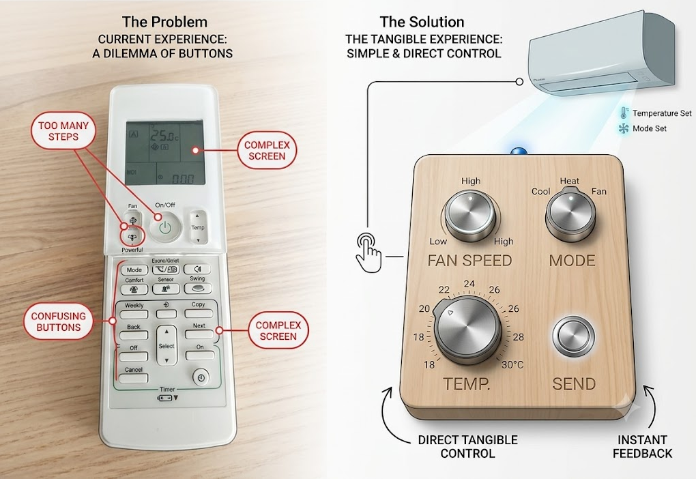
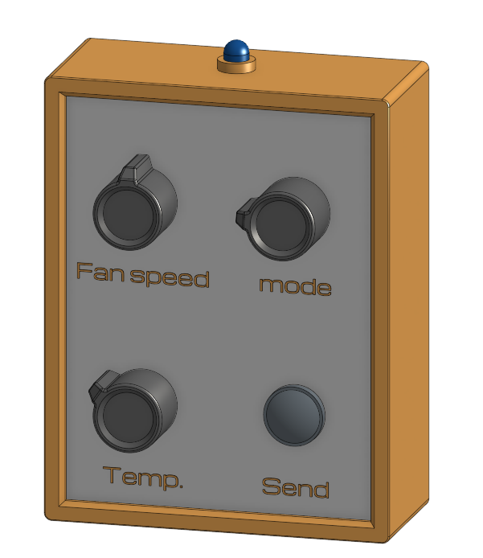
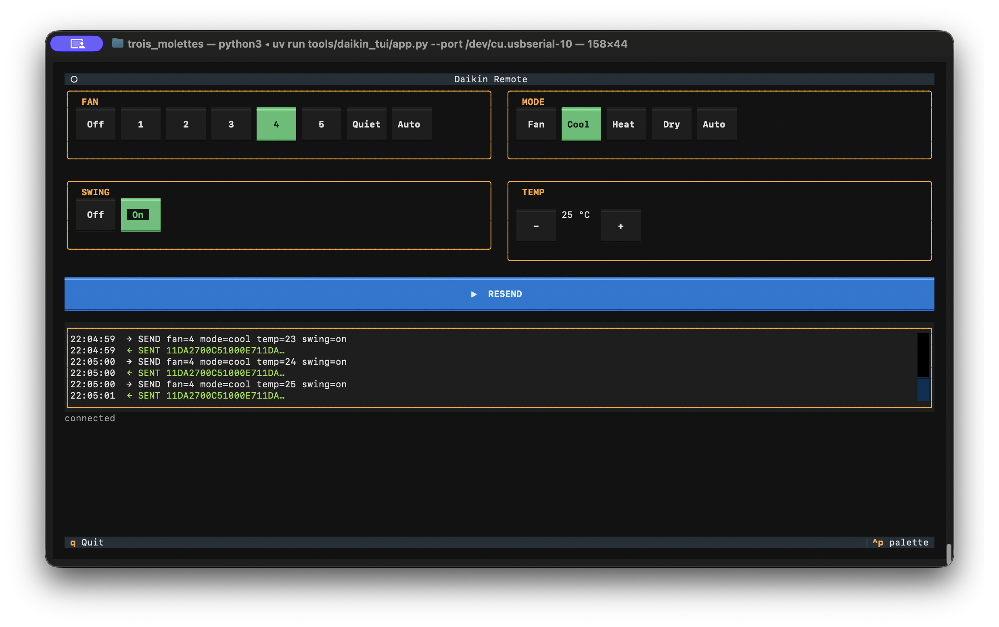
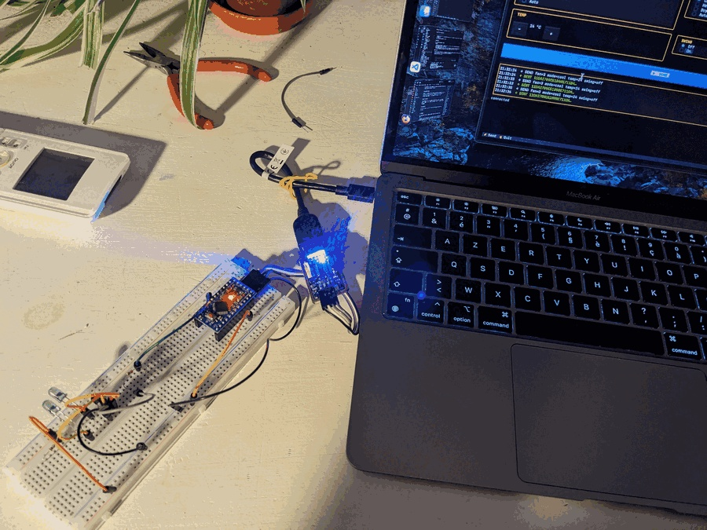

# TroisMolettes

**A better AC remote** — a physical IR remote for a Daikin split unit that is:

- **tangible** — all-hardware controls, no screen or app
- **stateless** — no menus; the knob positions _are_ the state
- **nicely designed** — an object worth leaving on the table

Three rotary knobs set **fan speed/power**, **mode**, and **temperature**. A **Send** push button transmits the current state via IR; an optional **Swing** toggle handles louvre swing if panel space allows. There is no per-position indicator — the only feedback is a single LED that flashes on send. A single (or 3× fanned) IR LED transmits to the AC unit.

Target AC unit: Daikin FTXM20N2V1B · Original remote: ARC466A33 · Protocol: `DAIKIN` (frame ported to AVR `IRremote`; `IRDaikinAC` from IRremoteESP8266 used as the reference format)

## Files

| File                                                                    | Description                                                                                                       |
| ----------------------------------------------------------------------- | ---------------------------------------------------------------------------------------------------------------- |
| [00_specifications.md](docs/00_specifications.md)                       | Full project requirements: controls, feedback, power, enclosure                                                  |
| [01_technical_design_overview.md](docs/01_technical_design_overview.md) | Design summary: choices, trade-offs, and the open decisions (readout/wake, sleep current)                        |
| [01_IR_protocol_and_mapping.md](docs/01_IR_protocol_and_mapping.md)     | Daikin IR protocol (frame structure, parameters, library usage, control mapping)                                 |
| [02_BOM_prototype.csv](docs/02_BOM_prototype.csv)                       | Bill of materials with prices and sourcing notes                                                                 |
| [03_microcontroller_choice.md](docs/03_microcontroller_choice.md)       | MCU comparison (nRF52840 / STM32L4 / ATmega328P) on sleep current + multi-pin wake; ATmega328P chosen, rationale |
| [04_rotary_switch_choice.md](docs/04_rotary_switch_choice.md)           | Rotary switch families compared, part selection, decision matrix                                                 |
| [05_electronics_circuit.md](docs/05_electronics_circuit.md)             | Input wiring: diode-encoded readout, multi-GPIO PCINT wake, pin map, sleep/wake sequence                         |
| [06_IR_LED_wiring.md](docs/06_IR_LED_wiring.md)                         | IR emitter: TSAL6200 + S9013 driver, single/3× wiring, bulk cap, wide-angle vs range, mounting strategies        |
| [07_battery_and_power.md](docs/07_battery_and_power.md)                 | Power architecture: Li-Po + TP4056, sleep-current budget, Pro Mini battery mods, charging                        |
| [10_software_architecture.md](docs/10_software_architecture.md)         | Firmware layers: portable Daikin frame builder, AVR HAL (Timer2/sleep), Linux mock                               |
| [11_serial_remote_app.md](docs/11_serial_remote_app.md)                 | Python Textual TUI soft front-panel over serial → ATmega → IR: protocol spec, app architecture (planned)         |

## Bench logs (build journal)

The [howtos/](howtos/) directory is the running record of bringing each subsystem up
on real hardware — including the dead-ends, false positives, and fixes. This is where
the three milestones (selector readout + sleep/wake, real Daikin IR comms, AVR port)
were actually proven.

| Log                                                                             | What it covers                                                                                          |
| ------------------------------------------------------------------------------- | ------------------------------------------------------------------------------------------------------- |
| [01_arduino_setup.md](howtos/01_arduino_setup.md)                               | Pro Mini / Nano (ATmega328PB) first flash: board config, CH340 wiring, 8 MHz upload speed               |
| [02_serial_debug.md](howtos/02_serial_debug.md)                                 | Garbled-serial root cause (CKDIV8 fuse → 4 MHz), workaround, and permanent ISP bootloader fix           |
| [03_rs1010_readout.md](howtos/03_rs1010_readout.md)                             | Diode-encoded rotary readout: GPIO config, inter-detent glitch, 10 ms debounce, PCINT sleep+wake        |
| [04_ir_receiver_signal.md](howtos/04_ir_receiver_signal.md)                     | TSOP38238 + scope: confirming the 3-frame Daikin structure and pulse-distance bit timing                |
| [05_ir_modulation_test.md](howtos/05_ir_modulation_test.md)                     | IR LED loopback + carrier check; the false-positive trap where a mis-wired transistor still "passed"    |
| [06_ir_rx_dump.md](howtos/06_ir_rx_dump.md)                                     | Capturing real ARC466A33 frames with the ATmega (PCINT delta buffer); checked-in reference dump         |
| [07_verify_frame_against_capture.md](howtos/07_verify_frame_against_capture.md) | Diffing `daikin_build_frame()` vs the capture — found 5 wrong fixed bytes breaking the checksums        |
| [08_daikin_fan_toggle.md](howtos/08_daikin_fan_toggle.md)                       | **Working end-to-end:** full frame over IR, AC beeps & changes fan speed; gap-timing + long-delay fixes |
| [09_rotary_switches_wake_test.md](howtos/09_rotary_switches_wake_test.md)       | All three diode-encoded switches together: multi-switch sleep/wake bench test on the assembled inputs   |

## Hardware summary

- **MCU:** ATmega328P (Pro Mini 3.3 V) — on hand, sufficient for this design, ported and tested. Sleeps in `SLEEP_MODE_PWR_DOWN`, woken by PCINT both-edge on every code/button line. Sleep floor dominated by the Pro Mini LDO quiescent (~75 µA) — bench-validation pending. (nRF52840 / STM32L4 were evaluated for lower µA-class sleep; see [03_microcontroller_choice.md](docs/03_microcontroller_choice.md))
- **IR:** TSAL6200 940 nm LED (×1 or ×3 fan) + S9013 NPN transistor driver · 38 kHz carrier via the 328P Timer2 (OC2B, pin D3) · Daikin ARC466A33 frame ported from the documented format and validated against the real unit
- **Inputs:** 3 rotary selectors (all 1-pole) + Send button (+ optional Swing toggle)
- **Rotary readout:** each switch diode-encoded into a small binary code on its own GPIO; the code lines double as both-edge wake interrupts (no ADC, no 2-pole, no analog rail) — see [05_electronics_circuit.md](docs/05_electronics_circuit.md)
- **Feedback:** single TX indicator LED (knob positions are the state)
- **Power:** Li-Po 3.7 V · TP4056 USB-C charging module · MCU in `SLEEP_MODE_PWR_DOWN` between transmissions, woken by PCINT edge (6-month → multi-year battery target — bench-validation pending)
- **BOM cost:** < €35
- **Enclosure:** 3D-printed ~80 × 100 × 25 mm, handheld or wall-mounted

## Status & roadmap

**Milestone reached — all three subsystems individually proven** (see the [bench logs](#bench-logs-build-journal)):

- ✅ Selector wiring + diode-encoded readout, deep sleep + PCINT wake (RS1010)
- ✅ Real IR comms with the Daikin unit — full frame, AC beeps & changes state
- ✅ Firmware ported to the ATmega328P (8 MHz, Timer2 carrier, validated frame)

Integration is underway. Planned in three phases, each de-risking the next:

1. **Python serial app** ([11_serial_remote_app.md](docs/11_serial_remote_app.md)) — a Textual
   TUI soft front-panel driving the AC over serial → 328P → IR. Goal: exercise the **full
   control mapping** (every Fan/Mode/Temp/Swing combination) from the keyboard and shake
   out mapping bugs while it's still just text — before committing any of it to physical knobs.

   

   
2. **✅ Prototype integration on a wood panel** — first prototype almost done: real
   encoders wired to the devboard, running end-to-end. Still missing: panel labels, the
   rs1010 side-switch panel layout, attaching the battery, and temperature-range tuning.

   Lessons learned:
   - A nice box without a PCB is hard — perfboard wiring mess and component size (the
     readout diodes especially) eat panel space fast.
   - A Li-Po battery is likely overkill; actual sleep/active current draw still needs
     measuring before picking a battery chemistry.
   - The rotary switch mounting and wiring approach needs rework — current method doesn't
     scale well to three knobs in an enclosure.
   - 3× IR LEDs work electrically but are not enclosure/design-friendly; worth revisiting
     against a single wider-angle LED.
   - Open question: is a dedicated swing switch worth the panel space, or should swing
     live on an existing control?

   **Next up: source rotary switches** — settle the mounting/wiring rework above before
   committing to the panel layout.
3. **Proper case + better wiring** — design the 3D-printed enclosure and revisit the wiring
   (perfboard → PCB?) once the panel prototype has fixed the real dimensions, the LED mount,
   and the layout that survived contact with reality.

The three design questions still open — IR LED mounting, encoder/knob choice, and case
style — are resolved _within_ these phases rather than up front (phase 2 settles LED mount
and knob feel; phase 3 settles the case).
