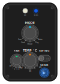
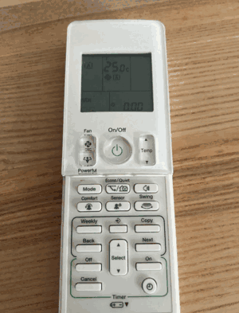
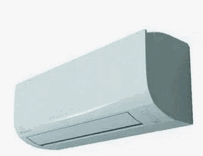
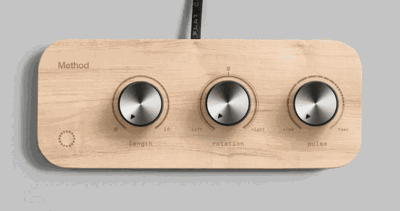

# TroisMolettes

A physical, tangible IR remote control for a Daikin split AC unit — no screen, no app, no menus. All controls are hardware (rotary switches, push buttons) with LED feedback for state.

## Inspiration

## Concept

Three rotary knobs control **mode**, **fan speed**, and **temperature**. Four push buttons handle secondary modes (Powerful, Econo, Swing, Resend). 25 WS2812B addressable LEDs provide color-coded state feedback. A single IR LED transmits to the AC unit.

Target AC unit: Daikin FTXM20N2V1B · Original remote: ARC466A33 · Protocol: `DAIKIN` via IRremoteESP8266

## Files

| File | Description |
|---|---|
| [00_specifications.md](00_specifications.md) | Full project requirements: controls, feedback, power, enclosure |
| [01_IR_protocol_and_mapping.md](01_IR_protocol_and_mapping.md) | Daikin IR protocol (frame structure, parameters, library usage, control mapping) |
| [02_BOM_prototype.csv](02_BOM_prototype.csv) | Bill of materials with prices and sourcing notes |
| [03_microcontroller_choice.md](03_microcontroller_choice.md) | MCU comparison: Pico vs ESP32 vs Arduino, decision rationale |
| [04_rotary_switch_choice.md](04_rotary_switch_choice.md) | Rotary switch families compared, ADC ladder readout, open sourcing questions |

## Hardware summary

- **MCU:** Raspberry Pi Pico (RP2040) — preferred for low sleep current (~1–2 mA) and 2 MB flash
- **IR:** 940 nm LED + NPN transistor driver · IRremoteESP8266 library · `IRDaikinAC` class
- **Inputs:** 3 rotary selectors (resistor ladder on ADC) + 4 tactile buttons
- **Feedback:** 25 WS2812B LEDs (1 GPIO chain) + 1 TX indicator LED
- **Power:** Li-Po 3.7 V · TP4056 USB-C charging module
- **Enclosure:** 3D-printed ~80 × 100 × 25 mm, handheld or wall-mounted
