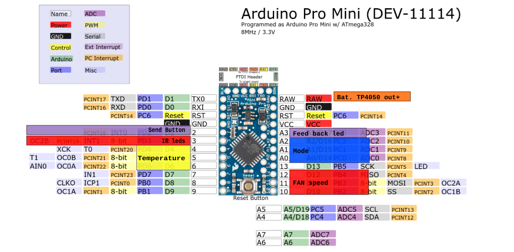
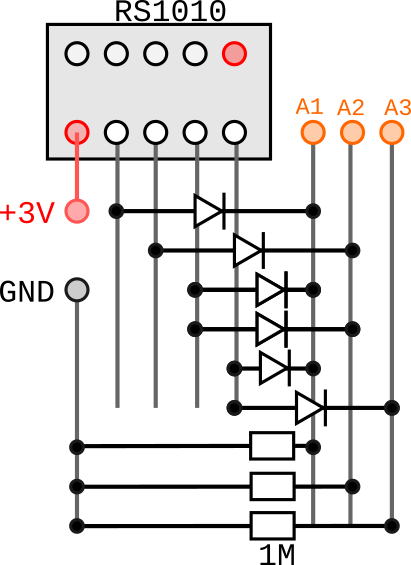

# Electronics Circuit — Input Wiring

How the rotary switches and buttons are wired to the ATmega328P.
For part selection see [04_rotary_switch_choice.md](04_rotary_switch_choice.md);
for power and battery see [07_battery_and_power.md](07_battery_and_power.md);
for the IR transmit driver see [06_IR_LED_wiring.md](06_IR_LED_wiring.md).

---

## 1. Overview

Three 1-pole rotary switches, diode-encoded onto independent GPIO groups.
One push button (Resend) and one optional toggle (Swing), direct to GPIO.
All lines are both-edge interrupt sources for deep-sleep wake.

```
ATmega328P
  PB2 PB3 PB4  ◄──  Fan speed  (SR16, 8 pos, 3 code lines)
  PC0 PC1 PC2  ◄──  Mode       (RS1010, 5 pos, 3 code lines)
  PD4 PD5 PD6  ◄──  Temp       (SR16, 8 pos, 3 code lines)
  PD2          ◄──  Resend button      (ext. pull-down, active-high — bench
                                         wiring; see §4)
  PD7          ◄──  Swing toggle (opt) (pull-up, active-low)
  PD3 (OC2B)  ──►  IR LED driver  ← validated end-to-end against the real unit
  PB5          ──►  TX LED (IR flash, visible)
  PC3          ──►  feedback LED (visible, always-on or status)
```

Pin total: 9 rotary + 2 buttons + 1 IR + 2 LEDs = **14 of 23 usable GPIO**.

### Pin assignment (with Arduino Pro Mini labels)

The AVR port names are primary — the Timer2/OC2B (IR carrier) and INT0/PCINT (wake)
reasoning depends on them. The **Arduino** column gives the silkscreen label to solder
to on the Pro Mini board.

| Function | AVR pin | Arduino | Dir | Notes |
|---|---|---|---|---|
| Fan speed b0 | PB2 | D10 | in | |
| Fan speed b1 | PB3 | D11 | in | MOSI — shared with ICSP during flash |
| Fan speed b2 | PB4 | D12 | in | MISO — shared with ICSP during flash |
| Mode b0 | PC0 | A0 | in | |
| Mode b1 | PC1 | A1 | in | |
| Mode b2 | PC2 | A2 | in | |
| Temp b0 | PD4 | D4 | in | |
| Temp b1 | PD5 | D5 | in | |
| Temp b2 | PD6 | D6 | in | |
| Resend button | PD2 | D2 | in | INT0 — external interrupt for wake; ext. pull-down, active-high (see §4) |
| Swing toggle | PD7 | D7 | in | optional |
| IR LED driver | PD3 | D3 | out | OC2B (Timer2) — **fixed**, validated |
| TX LED | PB5 | D13 | out | SCK — also the on-board LED on most Pro Minis |
| Feedback LED | PC3 | A3 | out | |

**Power / non-GPIO connections** (see [07_battery_and_power.md](07_battery_and_power.md)):

| Net | Pro Mini pin | From | Notes |
|---|---|---|---|
| Battery + | RAW | TP4056 OUT+ | cell voltage 3.0–4.2 V → on-board LDO → 3.3 V rail |
| Ground | GND | TP4056 OUT− | common ground |
| 3.3 V rail | VCC | on-board LDO out | feeds MCU + switch wipers + IR driver |

The TP4056 module charges the cell from USB-C and provides DW01A over-discharge /
over-current protection; its OUT+ / OUT− feed the Pro Mini **RAW** pin (onboard LDO
path). Remove the Pro Mini power LED for battery use — see
[07_battery_and_power.md §3–4](07_battery_and_power.md).



The **IR driver is fixed at PD3 (OC2B)** — the carrier is generated by Timer2 toggling
OC2B, and this is the path validated end-to-end against the real unit
([sketches/daikin_fan_toggle](../sketches/daikin_fan_toggle)). All other assignments are
free and were arranged around it (Resend moved to PD2/INT0, Temp lines to PD4–PD6).

---

## 2. Diode encoding

Each 1-pole rotary switch has its wiper connected to **+3.3 V**.
From each position contact, small-signal diodes route to the code lines that should
read HIGH for that position. The code lines have **1 MΩ pull-downs to GND** — the
GPIO inputs are configured as plain `INPUT` (high-Z, no internal pull-up).

Reading the GPIO group as a binary nibble gives the switch position directly.

All three switches use **3 code lines** (natural binary, positions 0–N).
`position = read_gpio_group()` directly — no lookup, no offset in hardware.
The temperature range offset (heating vs cooling) is applied in firmware based on the Mode knob.

### Fan speed — SR16 1P8T (8 positions, 3 bits)

| Position | b2 | b1 | b0 | Meaning |
|---|---|---|---|---|
| 0 | 0 | 0 | 0 | Off |
| 1 | 0 | 0 | 1 | Speed 1 |
| 2 | 0 | 1 | 0 | Speed 2 |
| 3 | 0 | 1 | 1 | Speed 3 |
| 4 | 1 | 0 | 0 | Speed 4 |
| 5 | 1 | 0 | 1 | Speed 5 |
| 6 | 1 | 1 | 0 | Quiet |
| 7 | 1 | 1 | 1 | Auto |

### Mode — RS1010 1P (5 positions, 3 bits)

| Position | b2 | b1 | b0 | Mode |
|---|---|---|---|---|
| 0 | 0 | 0 | 0 | Fan |
| 1 | 0 | 0 | 1 | Cool |
| 2 | 0 | 1 | 0 | Heat |
| 3 | 0 | 1 | 1 | Dry |
| 4 | 1 | 0 | 0 | Auto |

Positions 5–7 are unused (switch has no detent there).

### Temperature — SR16 1P8T (8 positions, 3 bits)

| Position | b2 | b1 | b0 | Cooling (°C) | Heating (°C) |
|---|---|---|---|---|---|
| 0 | 0 | 0 | 0 | 20 | 14 |
| 1 | 0 | 0 | 1 | 22 | 16 |
| 2 | 0 | 1 | 0 | 24 | 18 |
| 3 | 0 | 1 | 1 | 26 | 20 |
| 4 | 1 | 0 | 0 | 28 | 22 |
| 5 | 1 | 0 | 1 | 30 | 24 |
| 6 | 1 | 1 | 0 | 32 | 26 |
| 7 | 1 | 1 | 1 | 34 | 28 |

Firmware: `temp_C = position * 2 + (mode == HEAT ? 14 : 20)`

### Wiring diagram



### Diode count

A diode is placed for each set bit in each position code:

| Switch | Positions used | Total diodes |
|---|---|---|
| Fan speed (SR16) | 8 | 12 |
| Mode (RS1010) | 5 | 4 |
| Temperature (SR16) | 8 | 12 |

Use **1N4148** (THT) or **BAV99 / BAV70** (SOT-23, 2 per package).
Lay out as one rail per code line, diodes from contacts to rails — clean on perfboard.

### Why each switch needs its own lines

If three switches shared a bus, their codes would OR together and become unreadable
without active scanning (MCU awake, mux selected). Independent lines keep readout
and wake trivial, and match the stateless principle: the MCU can read the full state
at any time after waking, without context.

---

## 3. Pull-down value and sleep leakage

The wiper is held at +3.3 V continuously — including during sleep. This is required:
the settled code must stay on the lines so the wake interrupt can see an edge on the
next move. Gating the wiper supply would zero all lines and kill wake.

The pull-downs therefore draw current whenever a code line is HIGH. With **1 MΩ**:
~3.3 µA per HIGH line. Typically 1–2 lines are HIGH per switch → a few µA total.

Do **not** use `INPUT_PULLUP`: the chip's ~20–50 kΩ internal pull-up fights the
external pull-down (50× stronger), lines would read HIGH always, and ~165 µA/line
would flow.

On the ATmega328P Pro Mini the sleep floor is dominated by the onboard LDO quiescent
current (~75 µA), not the pull-down leakage — so 1 MΩ is comfortably below the floor
and a smaller value would still be acceptable. Bench-validate that reads are still
reliable at 1 MΩ before treating it as settled.
See [07_battery_and_power.md §3](07_battery_and_power.md) for the full leakage budget.

---

## 4. Buttons

**Resend** (PD2 / INT0) — push button, retransmits the current knob state
unchanged (no stored state to diverge from physical position — see
[00_specifications.md](00_specifications.md)).
**Swing** (PD7) — on/off toggle, optional.

The two buttons use different wiring conventions on the bench:

**Resend** follows the rotary-switch convention (§2), not the internal
pull-up scheme originally planned: the button connects the GPIO to **+3.3 V**
when pressed, with an **external pull-down to GND** at rest. The pin is
configured as plain `INPUT` (high-Z, no internal pull-up) — pressed = HIGH,
released = LOW.

```
+3.3V ── button ──┬── GPIO (plain INPUT)
                   └── pull-down ── GND
                  (reads LOW at rest, HIGH when pressed)
```

Do **not** use `INPUT_PULLUP` here for the same reason as §3: the internal
pull-up would fight the external pull-down.

**Swing** still uses the originally-planned internal-pull-up scheme: it
connects between the GPIO and GND, with the pin in `INPUT_PULLUP` —
pressed/on = LOW, released/off = HIGH.

```
GPIO (INPUT_PULLUP) ──┬── toggle ── GND
                      └── (reads HIGH at rest, LOW when on)
```

No external resistor needed for Swing. Each line is armed for both-edge
interrupt for wake.

---

## 5. Wake — both-edge interrupts on every line

The ATmega328P uses **PCINT** (pin-change interrupt) for deep-sleep wake from
`SLEEP_MODE_PWR_DOWN`. PCINT fires on any logic-level change on a masked pin —
it is genuinely both-edge per pin.

ARM every code line and every button line before sleeping:

```c
// Example for Fan lines on PORTB (PB2/PB3/PB4 = PCINT2/3/4)
PCICR  |= _BV(PCIE0);
PCMSK0 |= _BV(PCINT2) | _BV(PCINT3) | _BV(PCINT4);
```

On any knob move or button press, ≥1 line changes → PCINT fires → MCU wakes.
The ISR does nothing except return; the main loop re-reads and debounces.

On a non-shorting switch, the inter-detent float (all lines momentarily 0) produces
extra edges — that only helps, it never prevents wake.

### Debounce

After waking, wait for the code to settle before reading:

```c
uint8_t readDebouncedCode() {
    uint8_t prev = readCodeOnce();
    for (uint8_t i = 0; i < MAX_SETTLE_TRIES; i++) {
        delay(SETTLE_MS);  // 10 ms validated on the RS1010
        uint8_t cur = readCodeOnce();
        if (cur == prev) return cur;
        prev = cur;
    }
    return prev;
}
```

The 10 ms settle window is validated on the RS1010 — see [howtos/03_rs1010_readout.md](../howtos/03_rs1010_readout.md).

---

## 6. Sleep / wake sequence

```
sleep  (SLEEP_MODE_PWR_DOWN, all lines PCINT-armed)
  │
  │  any code-line edge  ──or──  Resend / Swing edge
  ▼
wake
  read Fan (3b), Mode (3b), Temp (3b) with debounce
  apply temp offset: temp_C = pos * 2 + (mode == HEAT ? 14 : 20)
  read Swing toggle state
  if any knob position changed, or Resend pressed:
      build Daikin frame, transmit IR, flash TX LED
  ▼
sleep
```

The device transmits whenever a knob position changes (knob position *is* the
state — see [00_specifications.md](00_specifications.md)) and additionally on
an explicit Resend press, which retransmits the current state unchanged
without requiring a knob move — e.g. to recover from a signal the AC unit
missed.

---

## 7. Alternatives considered

**A — resistor ladder + 2-pole alternating-contact wake.** Each switch position maps to
an ADC voltage via a resistor chain. A second pole with alternating GND/3.3 V contacts
provides the wake edge. Works, but requires 2-pole switches (scarce for 11 positions),
a gated analog rail, and ADC calibration.

**B — RC differentiator + comparator.** A high-pass filter on the ADC wiper line
differentiates the position-change step into a voltage spike for wake detection. Frees
the switch to 1-pole but keeps the analog ladder and adds a comparator IC. Strictly
more complex than the chosen scheme.

**C — off-the-shelf coded rotary switch.** Position output directly as a 4-bit binary
code, built into the switch. Electrically identical to the chosen scheme but commercial
coded switches have screwdriver-slot shafts and no tactile detent feel — wrong for
a hand-turned interface. The chosen scheme is option C built on a big 1-pole switch.
