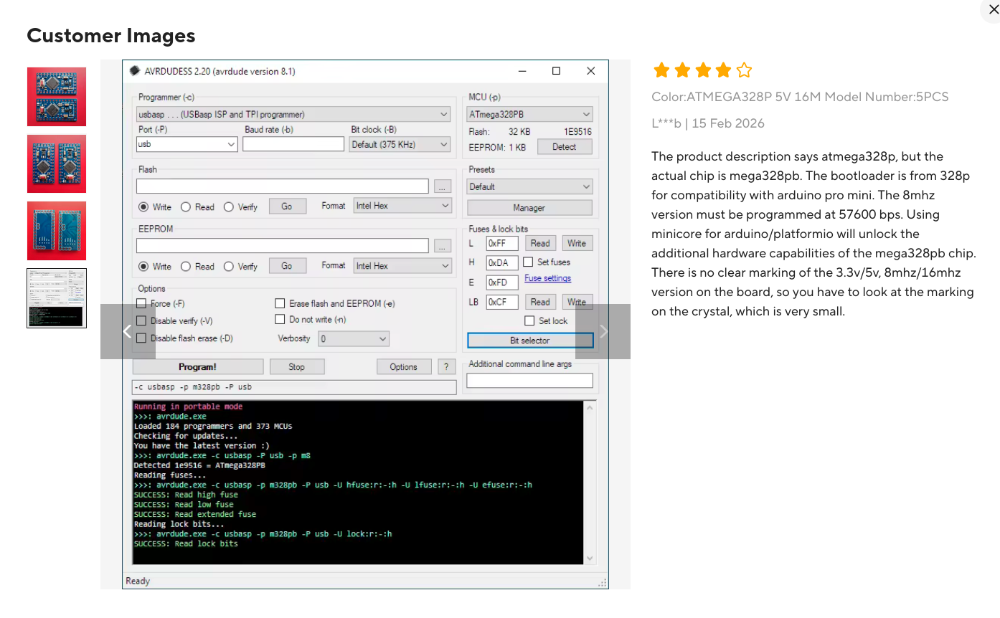
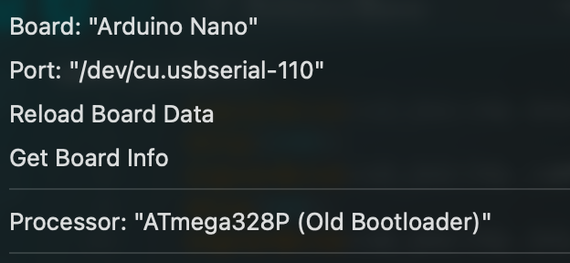

# Arduino Nano First Setup

## Hardware Requirements

### Arduino Nano Board - "datasheet":



**Key Product Details** (from AliExpress listing):
- **Microcontroller**: ATmega328PB (actual chip, despite 328p labeling)
- **Clock Speed**: 8 MHz or 16 MHz version
- **Flash Memory**: 32 KB
- **EEPROM**: 1 KB
- **Bootloader**: Compatible with Arduino Pro Mini (328p)

**For 8MHz Board**:
- **Serial Upload Speed**: Must be set to **57600 bps** (not the default 115200)
- **Crystal Marking**: The board does not have clear 8MHz/16MHz marking, so check the crystal component
- **Minicore Support**: Use [Minicore](https://github.com/MCUdude/MiniCore) for Arduino IDE to unlock additional hardware capabilities

### USB to TTL Module

- **Module**: CH340N
- **macOS Driver**: Built-in (no additional driver needed)
- **Device Path**: `/dev/tty.usbserial-110`

#### Wiring Configuration

- **Power**: 3V3 from USB
- **TX**: USB TX → Arduino Nano RX
- **RX**: USB RX → Arduino Nano TX
- **GND**: USB GND → Arduino Nano GND

## Arduino IDE Configuration

| Setting | Value |
|---------|-------|
| Board | Arduino Nano |
| Processor | ATmega328P (Old Bootloader) |
| Baud Rate | **57600** (for 8MHz board) |

**Critical for 8MHz version**: Set baud rate to 57600 instead of the default 115200 during upload.



**Reference**: [Arduino Forum - Bad CPU Type Issue](https://forum.arduino.cc/t/bad-cpu-type-in-executable/1391501/15)

## Upload Instructions

1. Connect the USB to TTL module to your computer
2. In Arduino IDE, set the **baud rate to 57600** (Tools → Upload Speed)
3. Open your sketch in Arduino IDE
4. Click **Upload**
5. When "Uploading..." appears, **press Reset** on the Arduino Nano board

## Test & Verification

### Blink Pattern Demo

Use this sketch to test that your board is working correctly. It will blink the built-in LED (L) in a pattern:

```cpp
void setup() {
  pinMode(LED_BUILTIN, OUTPUT);
}

void loop() {
  // Long off
  digitalWrite(LED_BUILTIN, LOW);
  delay(1000);
  
  // Three short blinks (SOS pattern)
  for (int i = 0; i < 5; i++) {
    digitalWrite(LED_BUILTIN, HIGH);
    delay(100);
    digitalWrite(LED_BUILTIN, LOW);
    delay(100);
  }
}
```

**Expected Behavior**: The LED will blink five short pulses, then repeat.


### Upload logs
- set config: File > Preferences > check "Show verbose output during: upload" 
````
Using port            : /dev/cu.usbserial-110
Using programmer      : arduino
Setting baud rate     : 57600
AVR part              : ATmega328P
Programming modes     : SPM, ISP, HVPP, debugWIRE
Programmer type       : Arduino
Description           : Arduino bootloader using STK500 v1 protocol
HW Version            : 2
FW Version            : 1.16

AVR device initialized and ready to accept instructions
Device signature = 1E 95 0F (ATmega328P, ATA6614Q, LGT8F328P)
Reading 960 bytes for flash from input file sketch_jun19b.ino.hex
in 1 section [0, 0x3bf]: 8 pages and 64 pad bytes
Writing 960 bytes to flash
Writing | ################################################## | 100% 0.32s
960 bytes of flash written
Avrdude done.  Thank you.
```