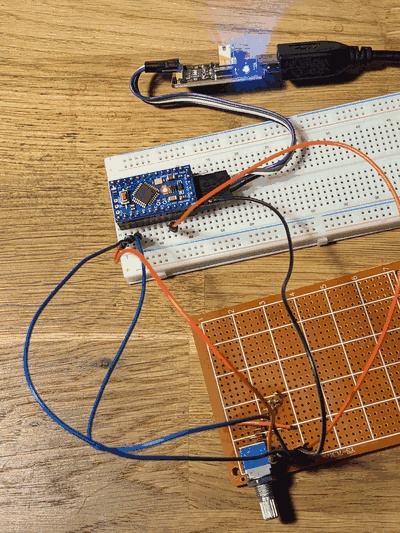

# RS1010 Readout — Wiring Test & Debounce

Bench notes from testing the diode-encoded RS1010 rotary switch readout.
See [05_electronics_circuit.md](../docs/05_electronics_circuit.md) for the full design rationale
(§2 diode encoding, §3 pull-down / leakage, §5 wake + debounce) and
[07_battery_and_power.md](../docs/07_battery_and_power.md) for the sleep-current budget.



## Wiring under test


Per §2 / §3 of the circuit doc:

- Wiper at **+3.3 V**.
- Each position contact → diode → one or more code lines (HIGH on selected position).
- Each code line → **external 1 MΩ pull-down** to GND, on the board.
- Each code line → one MCU GPIO.

For the bench test, 3 code lines are wired to **D10, D11, D12** on the ATmega328PB
(= PB2/PB3/PB4 → PCINT2/3/4, all in PCI group 0). 3 lines covers all three
selectors in the final design (Fan 8-pos, Mode 5-pos, Temp 8-pos — see
[00_specifications.md §4](../docs/00_specifications.md)); each needs exactly 3 bits.

## GPIO config: `INPUT`, not `INPUT_PULLUP`

The 1 MΩ external pull-downs are already on the board, so the MCU pin must be
left high-Z:

```c
pinMode(CODE_PINS[i], INPUT);
```

`INPUT_PULLUP` would enable the chip's ~20–50 kΩ internal pull-up, which fights
the 1 MΩ external pull-down (the pull-up wins by ~50×) — every line would read
HIGH all the time, and ~165 µA per line would leak straight into the
[sleep-current budget](../docs/07_battery_and_power.md).

## The inter-detent zero glitch

On a non-shorting (break-before-make) switch, all of that switch's code lines
briefly read 0 during the float between detents. Without debounce, the loop
latches a transient "position 0" reading every time the knob is turned.

§5 of the circuit doc calls for this directly: wait for **two consecutive
agreeing reads** before accepting the code.

```c
uint8_t readDebouncedCode() {
    uint8_t prev = readCodeOnce();
    for (uint8_t i = 0; i < MAX_SETTLE_TRIES; i++) {
        delay(SETTLE_MS);
        uint8_t cur = readCodeOnce();
        if (cur == prev) return cur;
        prev = cur;
    }
    return prev;
}
```

### Settle window: 10 ms

Bench result on this switch:

| `SETTLE_MS` | Result |
|---|---|
| 5 ms | Too low — float-zero glitches still leak through; intermediate readings occasionally latched |
| **10 ms** | Stable — no false zeros, no missed real moves |

10 ms is well under any plausible human re-rotation interval, so it's a free
margin — no reason to tune it tighter.

## Sleep + IRQ wake (PCINT)

The same code lines also serve as wake sources, as planned in §5. On the
328P, D10/D11/D12 land on PORTB → PCINT2/3/4 → vector `PCINT0_vect`. Setup:

```c
PCICR  |= _BV(PCIE0);
PCMSK0 |= _BV(PCINT2) | _BV(PCINT3) | _BV(PCINT4);
```

Then `SLEEP_MODE_PWR_DOWN` + `sleep_cpu()` between events. Any code-line edge
(including the float transient) wakes the MCU; the loop re-reads with debounce
and goes back to sleep.

**Caveats observed:**

- `millis()` / Timer0 is stopped in power-down, so periodic-tick prints
  inside the sleep loop do not fire — only GPIO events wake the MCU. That's
  the intended battery-mode behaviour; if a heartbeat is needed, add WDT.
- `Serial.flush()` is required before `sleep_cpu()`, otherwise the last line
  is truncated when USART is gated.
- `LED_BUILTIN` is D13 = PB5 = **PCINT5** in the same PCI group. The PCMSK0
  mask above excludes it, so driving the awake-indicator LED doesn't
  spuriously wake the MCU.

## Open design questions / next to validate

- **All three selectors on 3 lines each.** This bench tested one switch on 3 code lines.
  The final design keeps every selector at 3 bits (Fan 8-pos, Mode 5-pos, Temp 8-pos),
  so no 4th line is needed — confirm debounce holds across all positions of each switch
  when wired to its own GPIO group ([05 §1](../docs/05_electronics_circuit.md)).

- **Pull-down value vs. leakage.** 1 MΩ was chosen to keep sleep leakage in the µA
  range. On the ATmega328P the sleep floor is dominated by the Pro Mini LDO quiescent
  (~75 µA), so the ~3.3 µA/line pull-down leakage sits comfortably under it — but still
  validate that 1 MΩ gives reliable reads before treating it as settled. See the budget
  in [07_battery_and_power.md §3](../docs/07_battery_and_power.md).

## Sketches

The single-switch polling and sleep/wake sketches originally used for this
bring-up (`rs1010_poll_test`, `rs1010_wiring_test`) have since been folded
into the consolidated all-inputs test — see
[sketches/rotary_switches_wake_test/rotary_switches_wake_test.ino](../sketches/rotary_switches_wake_test/rotary_switches_wake_test.ino)
and [09_rotary_switches_wake_test.md](09_rotary_switches_wake_test.md). It
covers all three rotary switches plus Resend and Swing, sleeping in
`SLEEP_MODE_PWR_DOWN` and waking on PCINT exactly as demonstrated here,
extended to all three PCI groups.
