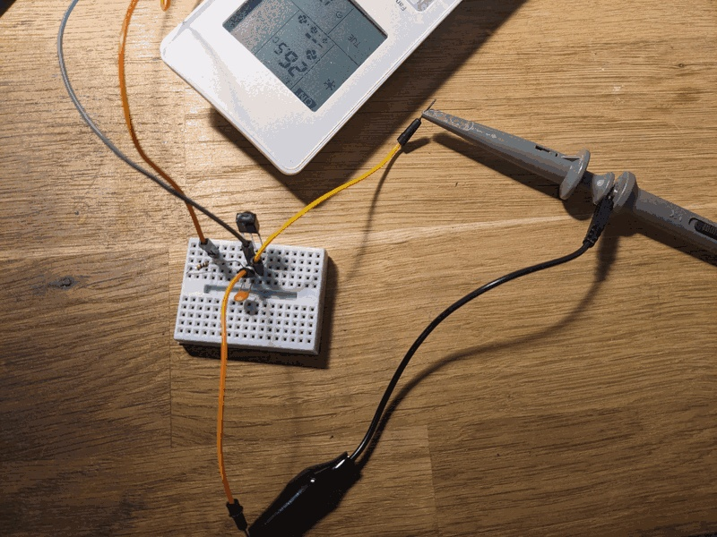
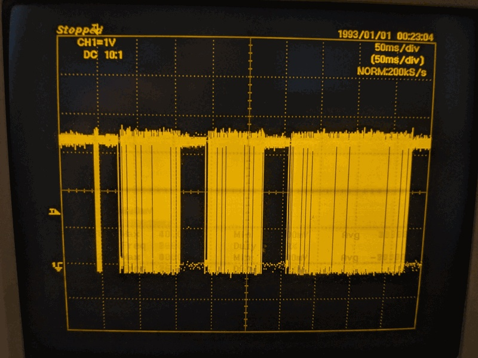
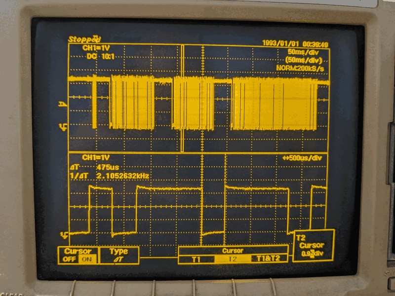

# IR Receiver Signal — TSOP38238 + Oscilloscope

Bench notes from observing the Daikin remote IR signal with a TSOP38238 demodulator and oscilloscope.
See [06_IR_LED_wiring.md](../docs/06_IR_LED_wiring.md) for the emitter design, and [Annex A1 — IR protocol & mapping](../docs/A1_IR_protocol_and_mapping.md) for the full protocol reference.

## Goal

Verify the Daikin IR signal structure before building the emitter — cheap, fast sanity check with parts on hand.



## Circuit

The TSOP38238 is a complete demodulator: 38 kHz bandpass filter + envelope detector + logic output. No external demodulation needed.

```
5V ──── 100 Ω ──── VS (pin 3) ──┬── 4.7 µF ── GND
                                 │
                                GND (pin 2)

OUT (pin 1) ──── oscilloscope probe CH1
```

Pinout (flat side facing you, pins down): OUT | GND | VS

The 100 Ω + 4.7 µF on VS is from the TSOP datasheet — suppresses power supply noise that causes spurious pulses. Don't skip it.

Output is **active low**: HIGH = idle, LOW = carrier burst detected.

## Scope settings

- Timebase: 10 ms/div to capture the full transmission (~350 ms total)
- Trigger: falling edge, ~1.5 V threshold, single shot
- Zoom to 500 µs/div to see individual bit pulses

## Measured signal structure

Full transmission from ARC466A33 remote (one button press):



```
~5 ms   LOW    leader pulse (AGC calibration burst)
 35 ms  HIGH   inter-frame gap
 83 ms  LOW    Frame 1 — 8 bytes, fixed preamble
 35 ms  HIGH   inter-frame gap
 83 ms  LOW    Frame 2 — 8 bytes, fixed preamble
 35 ms  HIGH   inter-frame gap
165 ms  LOW    Frame 3 — 19 bytes, full AC state
```

This matches the documented 3-frame Daikin structure exactly.
The leader is a standalone AGC burst, not a data frame.
Frame 3 is ~2× longer than frames 1 and 2 because it carries 19 bytes vs 8 bytes.

## Bit-level timing (pulse-distance encoding)

Zoom into any data frame to see individual bits:



```
mark  (LOW):  ~475 µs  — constant, carrier burst
space (HIGH): ~425 µs  → bit 0
space (HIGH): ~1250 µs → bit 1
```

The mark is fixed; the space duration encodes the bit value.
At 38 kHz, each 475 µs mark contains ~18 carrier cycles.

Each frame starts with a longer leader: ~3.5 ms mark + ~1.7 ms space — visibly wider than data pulses.
