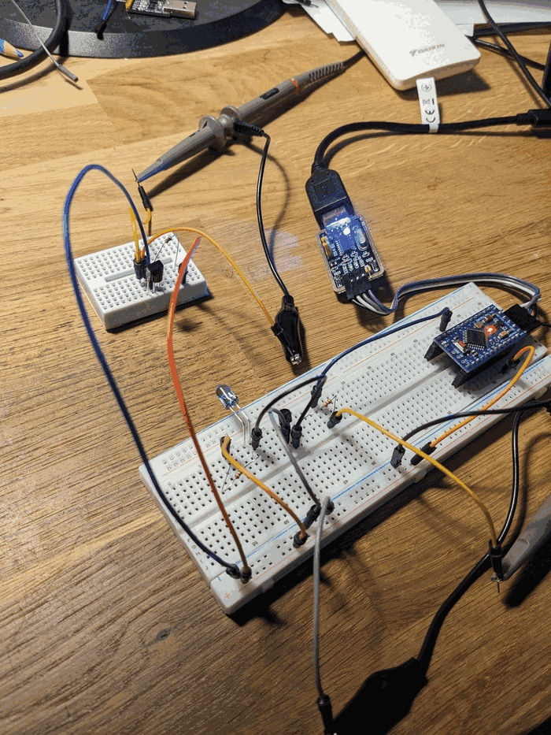
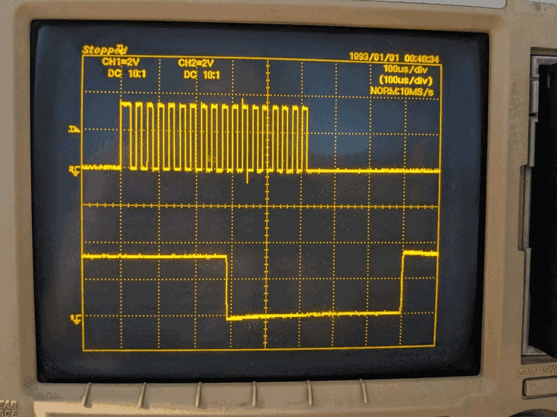

# IR Modulation Test — TSAL6200 + TSOP38238 + Oscilloscope

Bench notes for verifying the IR LED circuit using the receiver as a loopback
and the oscilloscope to observe both the raw carrier and the demodulated output.

See [06_IR_LED_wiring.md](../06_IR_LED_wiring.md) for the circuit design, and
[04_ir_receiver_signal.md](04_ir_receiver_signal.md) for the receiver wiring.

## Goal

Confirm that:
1. The transistor switches at the expected frequency (38 kHz carrier visible on CH2)
2. The TSOP38238 demodulates the burst and produces a clean active-low pulse (CH1)

No Daikin protocol needed — just a single burst every second from a minimal sketch.

## Bench setup

- Left breadboard: TSOP38238 receiver
- Main breadboard: IR LED + S9013 transistor circuit (see [06_IR_LED_wiring.md](../06_IR_LED_wiring.md))
- ATmega328PB Pro Mini connected via USB–serial adapter
- CH1 (scope, black clip): TSOP38238 OUT pin
- CH2 (scope, grey clip): IR LED GPIO input (D3, base side of transistor circuit)

Point the LED at the receiver from a few centimetres away.

## Sketch

[sketches/ir_modulation_test/ir_modulation_test.ino](../sketches/ir_modulation_test/ir_modulation_test.ino)

Sends one ~475 µs burst at 38 kHz every second. Serial output at 2400 baud
(sketch requests 4800 — halved by CKDIV8, see [02_serial_debug.md](02_serial_debug.md)).

### Timing workaround — CKDIV8 fuse

The chip runs at 4 MHz effective (CKDIV8 fuse active, IDE compiles for 8 MHz).
`delayMicroseconds()` executes 2× slower than requested. The sketch uses
`HALF_PERIOD_US 4` (requested) → ~8 µs actual half-period → ~62 kHz nominal,
but the `digitalWrite()` overhead at 4 MHz adds enough time to land near 36 kHz.

**Measured result: ~36 kHz** — close enough for the TSOP38238 (bandpass centred
at 38 kHz, −3 dB at roughly ±4 kHz). The receiver triggers reliably.

If the receiver stops responding, increase `HALF_PERIOD_US` by 1 and re-flash.

## Oscilloscope

Settings used:
- Timebase: **100 µs/div**
- CH1, CH2: 2 V/div, DC, 10:1 probe
- Trigger: CH2 rising edge, single shot

**CH2 (top):** raw 38 kHz carrier on D3 — ~18 pulses over ~4 divisions (~400 µs burst).

**CH1 (bottom):** TSOP38238 OUT — active-low pulse. Idle HIGH, drops LOW for the
duration of the burst, returns HIGH cleanly. The demodulator output confirms the
LED circuit fires correctly and the receiver sees the signal.

The burst width on CH1 matches CH2 within one or two carrier cycles — expected,
as the TSOP has a short internal propagation delay (~50–100 µs typical).
