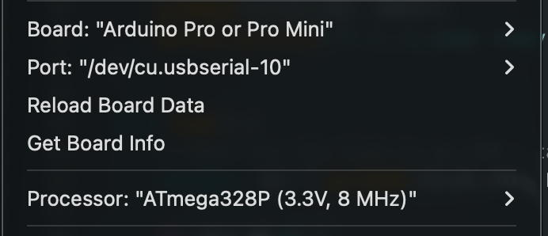

# IR RX Dump — Reading the Real Remote with the ATmega

The goal is to reverse-engineer the real Daikin remote (ARC466A33) by capturing its
raw IR timings with the ATmega, then comparing them byte-by-byte against the frames
produced by `daikin_build_frame()`.  If the AC unit doesn't respond to the ATmega
transmitter, this diff is the fastest way to find what's wrong.

## Sketch

[sketches/ir_rx_dump/ir_rx_dump.ino](../sketches/ir_rx_dump/ir_rx_dump.ino)

The ATmega listens on the TSOP38238 output (D2) and prints every mark and space
duration to serial as they arrive:

```
LEADER  6 pulses
gap     25432 us
SECTION 1
M 3492     <- section header mark (~3.5 ms)
S 1266     <- section header space (~1.7 ms)
M 454      <- data bit mark  (~450 us, always)
S 402      <- data bit space (<700 us -> bit 0, >700 us -> bit 1)
...
--- 34800  <- inter-section gap (~35 ms)
SECTION 2
...
===        <- end of full frame (gap > 60 ms)
```

A full Daikin frame has 3 sections separated by `---`; the whole frame ends
with `===`.

**Mark** = IR carrier burst detected (TSOP output LOW).
**Space** = silence between bursts (TSOP output HIGH).

The TSOP already strips the 38 kHz carrier — what arrives at D2 is the demodulated
envelope.

Serial at **115200 baud**.  `setup()` clears the AVR clock prescaler at runtime
(`CLKPR = 0`) so the chip always runs at its nominal 8 MHz regardless of the
CKDIV8 fuse state.

## Arduino IDE settings

Board: **Arduino Pro or Pro Mini**, Processor: **ATmega328P (3.3V, 8 MHz)**.



## Wiring

Same TSOP38238 already used for oscilloscope work in `04_ir_receiver_signal`:

```
TSOP OUT (pin 1) ──── D2
TSOP GND (pin 2) ──── GND
TSOP VS  (pin 3) ──── 100 Ω ──── 3.3 V
                              └── 4.7 µF ──── GND
```

## Capturing on macOS

Find the serial device:

```bash
ls /dev/cu.usbserial-*
```

`stty … && cat` does **not** work reliably on macOS — `cat` reopens the device
with default termios and resets the baud rate stty just set, so you get nothing
or garbage.  Use the pyserial helper script (replace `XXXX` with your device
suffix):

```bash
uv run sketches/ir_rx_dump/capture.py /dev/cu.usbserial-XXXX
uv run sketches/ir_rx_dump/capture.py /dev/cu.usbserial-XXXX -o dump.txt
```

The script is a self-contained [uv](https://docs.astral.sh/uv/) script (PEP 723
inline metadata pulls in `pyserial`), defaults to 115200 baud, and prints each
line as it arrives.  Press a button on the real remote, then Ctrl-C.  Each
button press produces one full frame ending with `===`.

## Captured reference: full fan-speed loop

[data/dump_fan_loop.txt](data/dump_fan_loop.txt) is a reference capture taken
with the ARC466A33 remote, cycling through every fan-speed setting (the full
loop: auto → 1 → 2 → 3 → 4 → 5 → quiet → auto).  Ten button presses, ten frames,
each terminated by `===`.  Use it as ground truth when decoding bytes or
diffing against `daikin_build_frame()` output — the file is checked in so the
decoder can be developed and tested without re-running the hardware capture
each time.

Structure of each frame in the dump:

- 6 short marks + 5 short spaces — the leader pulses.
- `--- 25xxx` — leader-to-section gap (~25 ms).
- `M ~3500 / S ~1700` — section 1 header, followed by 8 bytes of data (128
  mark/space pairs).
- `--- 35xxx` — inter-section gap (~35 ms).
- Section 2 (8 bytes), `--- 35xxx`, section 3 (19 bytes).
- `===` — end of frame (printed by `loop()` once the inter-press silence
  exceeds `FRAME_GAP`).

## Implementation: PCINT + delta buffer

**Status: working.**

The sketch uses a **pin-change interrupt (PCINT) to record every edge** into a
ring buffer, then decodes and prints from `loop()` once the frame is complete.

```cpp
ISR(PCINT2_vect) {
    uint32_t now = micros();
    last_edge_time = now;
    if (edge_count < BUF_LEN) {
        edges[edge_count++] = (uint16_t)(now - isr_prev);
        isr_prev = now;
    } else {
        buf_overflow = true;
    }
}
```

`loop()` polls `edge_count` and `last_edge_time`.  When the line has been quiet
for longer than `FRAME_GAP` (60 ms) the frame is done: disable the ISR, decode,
print `===`, re-enable.  All Serial output happens during inter-frame silence —
no timing pressure.

### Why polling-based approaches all failed

Earlier attempts using `pulseIn()` or a `micros()`-based polling loop in `loop()`
hit the same wall: Daikin needs to measure both **~400 µs data-bit spaces** and
**~35 ms inter-section gaps** in the same hot loop, and any `Serial.print` (~6 ms
at 9600 baud, ~0.5 ms at 115200) between a mark and the next space loses the
short ones.  `pulseIn(HIGH)` after a mark also waits for the *next* rising edge,
silently skipping the space already in progress.  PCINT solves this by moving
all measurement into the ISR and all printing into the quiet window after the
frame ends.

### Buffer sizing

A full Daikin button press emits one main frame (~320 edges: leader + 3 sections
of 8/8/19 bytes, 2 edges per bit) plus a repeat — in practice ~500–700 edges
total.  Storing absolute `uint32_t` timestamps would need 4 bytes per edge;
storing **`uint16_t` deltas** halves that to 2 bytes (each interval fits in
65535 µs, well above the 35 ms inter-section gap).  `BUF_LEN = 768` × 2 B =
1.5 KB, leaving ~500 B for Serial buffers, stack, and globals on the 2 KB
ATmega328P.

`edges[0]` is the elapsed time since the ISR was armed (meaningless); the decode
loop skips it and starts at index 1.

### Subtle bugs that bit during bring-up

Three bugs only showed up after the PCINT skeleton was working, and all
produced the same symptom — runs of `M M` or `S S` in the dump (alternation
should be strict):

1. **Phase detection inverted.**  The ISR was reading `PIND` at `idx == 1` to
   decide whether `edges[1]` was a mark or a space, with `first = !(PIND & PD2)`.
   But the ISR fires *after* the edge, so `PIND` reflects the level during the
   *next* interval.  Reading HIGH means the previous interval (`edges[1]`) was
   a mark, not a space.  The `!` was wrong; dropping it fixed the labeling.

2. **Torn read of `last_edge_time` in `loop()`.**  `last_edge_time` is a 4-byte
   `uint32_t` written by the ISR.  A non-atomic read from `loop()` can split:
   high byte from before the latest update, low byte from after.  The torn
   value occasionally looked far in the past, so `micros() - last_edge_time`
   exceeded `FRAME_GAP` and `loop()` decoded mid-signal.  Fix: wrap the reads
   in `cli()` / `SREG` restore.

3. **Buffer overflow handled by mid-frame re-arm.**  The original code decoded
   on `buf_overflow` and immediately re-armed the ISR.  But `decodeFrame()`
   prints ~512 lines at 115200 baud (~50 ms) while the ISR is disabled, losing
   every edge in that window — including possibly half a data bit.  The next
   captured edge then had the wrong parity.  Fix: only decode on true silence
   (`FRAME_GAP` since last edge), even after overflow.  Truncating the press
   to `BUF_LEN` edges is fine — the buffer is now sized to fit the whole
   press anyway.

### Tuning

- `FRAME_GAP = 60 ms`: longer than any intra-frame gap (max ~35 ms inter-section),
  shorter than the silence between button presses.
- `SECTION_GAP = 10 ms`: marks intra-frame gaps (printed as `--- nnnnn`), used
  only for human-readable labelling.
- `BAUD = 115200`: anything slower can't drain the TX buffer between presses.

## Analysis (once capture works)

A Python script can decode the dump into a byte array:

1. Parse `M`/`S` lines; skip `LEADER`, `gap`, `SECTION`, `---`, `===` lines.
2. Skip the first `M`/`S` pair of each section (the header mark/space).
3. For each bit: space < 700 µs → bit 0, space > 700 µs → bit 1.
4. Collect 8 bits LSB-first → one byte.  35 bytes total (Daikin frame length).
5. Compare against `daikin_build_frame()` output from `ir_mock/`.

## What to look for

| Difference | Likely cause |
|------------|-------------|
| Wrong bytes in section 3 only | Frame builder bug (sections 1 & 2 are fixed) |
| Timing values systematically off | `delayMicroseconds()` scaling issue |
| Extra or missing preamble bits | Preamble encoding bug in `send_daikin()` |
| Checksum byte wrong | `daikin_build_frame()` checksum logic |
