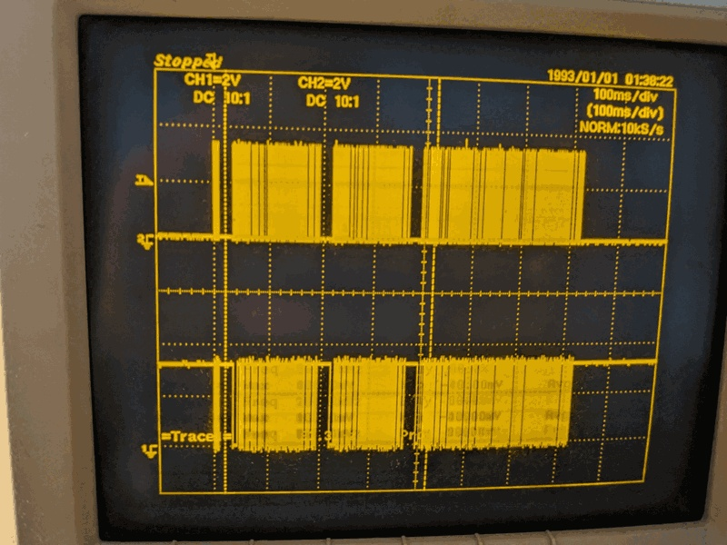
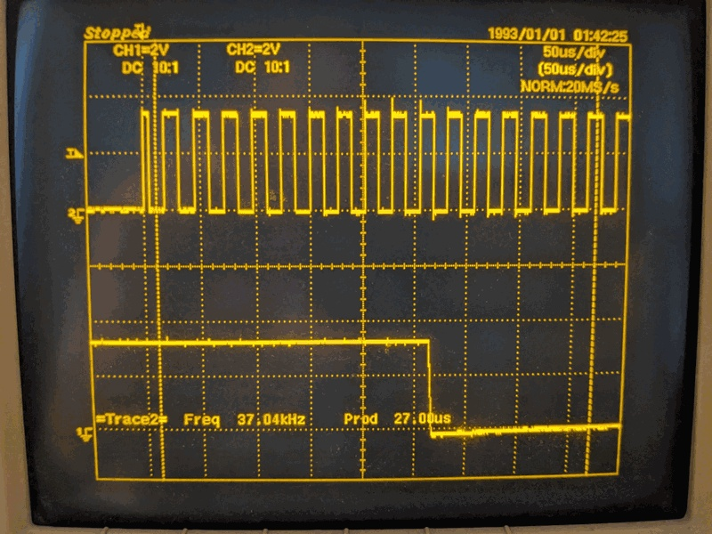

# Daikin Fan Toggle — First End-to-End IR Frame Test

First test of a real Daikin frame sent over the IR LED.  The sketch alternates
fan speed between MIN and MAX every 30 s.  If the AC unit responds, the full
chain works: `daikin_build_frame()` → pulse encoder → Timer2 carrier → IR LED → AC.

No oscilloscope needed — the AC unit is the loopback.

## Sketch

[sketches/daikin_fan_toggle/daikin_fan_toggle.ino](../sketches/daikin_fan_toggle/daikin_fan_toggle.ino)

Fixed AC state: Power ON, Mode Cool, Temp 22 °C.  Fan alternates:

| Step | Fan speed |
|------|-----------|
| odd  | MIN (1)   |
| even | MAX (5)   |

Serial output at 4800 baud.

## How it works

### Frame building

`daikin_build_frame()` from `firmware/daikin_frame.cpp` fills the 35-byte
frame.  **The byte content was corrected in
[07_verify_frame_against_capture](07_verify_frame_against_capture.md)** after a
diff against the real ARC466A33 capture revealed five fixed/reserved bytes the
library default left wrong (bytes 5, 13, 14, 31, 32) — which broke the per-section
checksums and is the likely reason earlier transmissions were ignored.  This
sketch picks up that fix automatically through `daikin_build_frame()`.

### Pulse encoding

`send_daikin()` follows the 3-section structure of `IRDaikinESP::sendDaikin()`,
but the **gap durations are taken from the real capture, not the library's
nominal 29 ms** (the library uses one 29 ms gap everywhere; the real remote does
not):

```
5-bit "00000" preamble  →  leader gap (~25 ms)
Section 1  bytes  0.. 7  →  HDR mark/space + 8 bytes + bit-mark + section gap
Section 2  bytes  8..15  →  HDR mark/space + 8 bytes + bit-mark + section gap
Section 3  bytes 16..34  →  HDR mark/space + 19 bytes + bit-mark + section gap
```

Timing constants — measured from the capture (decoded in howto 07), with the
library's nominal value shown for reference:

| Symbol            | Used    | Library nominal | Note |
|-------------------|---------|-----------------|------|
| HDR mark          | 3500 µs | 3650 µs         | capture ≈ 3492 |
| HDR space         | 1700 µs | 1623 µs         | capture ≈ 1712 |
| Bit mark          |  428 µs |  428 µs         | capture ≈ 449 |
| Zero space        |  428 µs |  428 µs         | capture ≈ 418 |
| One space         | 1280 µs | 1280 µs         | capture ≈ 1306 |
| Leader gap        | 25 000 µs | 29 000 µs     | post-preamble, capture ≈ 25.1 ms |
| Inter-section gap | 35 000 µs | 29 000 µs     | between sections, capture ≈ 35.5 ms |

### Long-gap pitfall — `delayMicroseconds()` only goes to ~16 ms

`delayMicroseconds()` is documented accurate only up to **16383 µs**; past that
it silently returns near-immediately.  The 25 ms leader gap and 35 ms
inter-section gaps both exceed that, so an early version of this sketch
collapsed all three sections into one continuous ~300 ms burst on the scope —
no visible gaps — and the AC unit ignored the frame.

The fix is a small helper that chunks the wait into 16 ms `delay()` slices
(carrier already off, so `delay()` is fine):

```c
static void ir_space_long(uint32_t us) {
    TCCR2A &= ~(1 << COM2B0);
    digitalWrite(IR_PIN, LOW);
    while (us >= 16000) { delay(16); us -= 16000; }
    if (us) delayMicroseconds((uint16_t)us);
}
```

Used for the leader gap and section gaps only; the sub-millisecond bit/header
spaces still go through the regular `ir_space()`.

### Carrier generation — Timer2 CTC

Timer2 in CTC mode toggles OC2B (D3) at the compare match.  With F_CPU = 8 MHz
and prescaler /1:

```
f = 8 000 000 / (2 × (OCR2A + 1)) = 8 000 000 / (2 × 105) ≈ 38.1 kHz
```

`OCR2A = 104` is set once in `setup()`.  `ir_mark()` reconnects the OC2B toggle;
`ir_space()` disconnects it and holds the pin LOW.

### Clock note — the CKDIV8 misdiagnosis

Earlier sketches in this repo (and earlier revisions of this one) assumed the
CKDIV8 fuse was active, dividing the 8 MHz internal RC clock down to 4 MHz.
The compensations included:

- `delayMicroseconds(us / 2)` everywhere (to undo a supposed 2× slowdown)
- `Serial.begin(4800)` with the monitor at 2400 baud (same idea)
- `OCR2A` values computed against a 4 MHz F_CPU

A scope measurement of the carrier disproved all of this:

| OCR2A | Predicted (4 MHz) | Predicted (8 MHz) | Measured |
|-------|-------------------|-------------------|----------|
| 52    | 37.7 kHz          | 75.5 kHz          | —        |
| 58    | 33.9 kHz          | 66.7 kHz          | **66.7 kHz** (15 µs period) |

The 8 MHz column matched exactly — so CKDIV8 is **not** active on this board.
All four corrections were undone:

- `delayMicroseconds(us)` — pass the protocol value as-is
- `Serial.begin(4800)` — monitor at 4800 baud
- `OCR2A = 104` — gives 38.1 kHz at 8 MHz

**Lesson for the other sketches:** any of `ir_modulation_test`, `serial_test`,
etc. that assume CKDIV8 will be running 2× too fast.  Re-measure before
trusting their timing.

## Oscilloscope — full frame

- CH1 (scope, black clip): TSOP38238 OUT pin
- CH2 (scope, grey clip): IR LED GPIO input (D3, base side of transistor circuit)





The oscilloscope confirms the 3-section structure: preamble burst, inter-section
gaps, and the three HDR mark / data / bit-mark sequences.  (These scope shots
predate the gap-timing fix and show the old uniform ~29 ms gaps; the sketch now
sends ~25 ms after the preamble and ~35 ms between sections.)

## Result — working end-to-end (2026-06-24)

After the long-gap fix the AC unit **beeps and switches fan speed on every
transmission**.  Confirmed live: alternating MIN ↔ MAX every loop iteration.

Range observation: reliable up to **~2–3 m** with the single IR LED on D3.
Beyond that, aiming becomes the limiting factor — the beam is too narrow to
hit the AC's receiver window without careful alignment.

**Next hardware step:** move from one LED to **three LEDs** spread across a
small angular range so the remote works from anywhere in the room without
aiming.  The transistor drive circuit already has the headroom; the schematic
work lives in `schematics/` (see project convention notes).

Serial monitor shows:

```
Daikin fan toggle — MIN/MAX every 30 s
Sending fan=MIN (1)
Sending fan=MAX (5)
...
```

## Troubleshooting

| Symptom | Likely cause |
|---------|-------------|
| AC does not respond at all | LED not pointing at AC receiver; check alignment and reduce distance (single LED reliable up to ~2–3 m). (The frame-content and gap-timing bugs that caused this before are now fixed — see howto 07.) |
| Scope shows preamble + one ~300 ms blob, no inter-section gaps | `delayMicroseconds()` overflow on the 25/35 ms gaps — use `ir_space_long()` (see *Long-gap pitfall* above) |
| AC responds to some frames but not others | Carrier frequency off — measure on a scope and tweak OCR2A (±1 ≈ ±0.6 kHz) |
| Garbled serial output | Wrong baud rate in monitor — use 4800 |
| Sketch won't compile, missing `daikin_frame.h` | The sketch dir contains symlinks to `../../firmware/daikin_frame.{h,cpp}` — make sure they survived a checkout (Windows clones drop symlinks by default) |

> **Status (2026-06-24):** Working end-to-end — AC beeps and changes fan
> speed on every transmission, range ~2–3 m with a single LED.  Three root
> causes for the earlier non-response were fixed: (1) five wrong
> fixed/reserved bytes that broke the section checksums (howto 07),
> (2) gap timings set to the library's uniform 29 ms instead of the remote's
> ~25 ms / ~35 ms, and (3) `delayMicroseconds()` silently truncating those
> long gaps so all three sections fused into one ~300 ms burst.
> **Next step: 3-LED array** to widen the beam and remove the aiming
> constraint past ~3 m.
